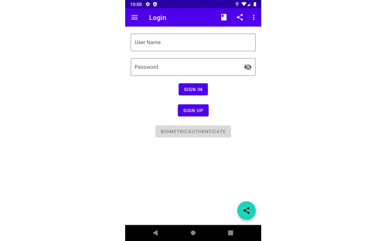
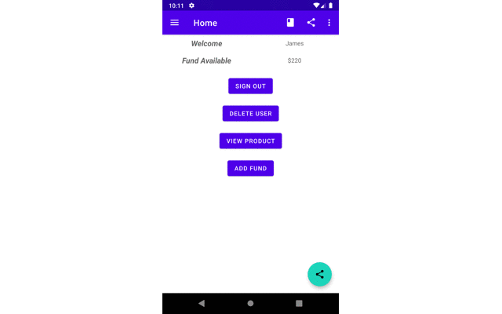
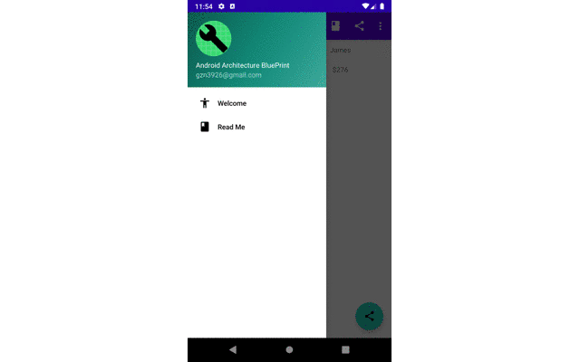

# Android Architecture BluePrint

This serves as a demo for various Android components, features and MVVM & Repository patterns

---

# Table of Contents
- [Concepts and Features](#concepts-and-features)
- [Flows](#flows)
- [3rd-Party Libraries](#3rd-party-libraries)
- [References](#references)

---
# Concepts and Features
- [X] Android App Components: [Activity, Services, Broadcast Receivers]
- [X] Android Navigation Component: [Navigation Graph, Controller]
- [X] Android Architecture Components: [View Binding, Data Binding, LiveData, Room, Work Manager, ViewModel, SaveStateHandle]
- [X] View Components: [RecyclerView, CardView, ConstraintLayout, TextInputLayout, and many other Material View Components]
- [X] Additional Features: [App Widget, App Shortcut, Notification, Security Storage, Biometric Authentication]
- [X] Kotlin and Coroutines
- [X] MVVM, Repository, and other patterns

---
# Flows
- Navigation Flow for sign in

- Navigation Flow for product purchase

- Additional Features

---
# 3rd-Party Libraries
- [X] Network: Retrofit 2
- [X] Json parsing: Moshi
- [X] Logging: Timber
- [X] Image Loading: Glide
- [X] Unit Testing: JUnit, Espresso, Truth, Mockk

---
# References
1. [Guide to app architecture](https://developer.android.com/jetpack/docs/guide)
2. [Android Architecture Components](https://developer.android.com/topic/libraries/architecture)
3. [Navigation](https://developer.android.com/guide/navigation)
